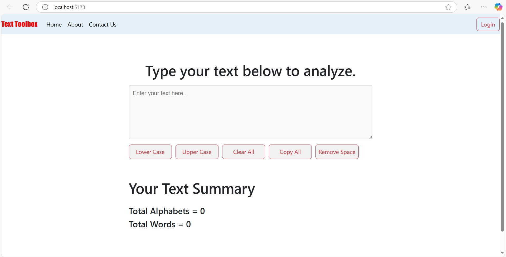

# 🛠️ Text Toolbox (Text Utils App)

Text Toolbox is a simple React.js application that allows users to perform various text manipulation tasks such as converting text to uppercase/lowercase, clearing input, copying text, and removing extra spaces. It also provides a quick text summary like total characters and words.

---

## 🚀 Features

- ✅ Convert text to **Uppercase**
- ✅ Convert text to **Lowercase**
- ✅ **Clear** all input text
- ✅ **Copy** text to clipboard
- ✅ **Remove extra spaces**
- ✅ View **summary**: word count & character count
- ✅ **Responsive UI** using Bootstrap

---

## 🧑‍💻 Tech Stack

- ⚛️ React.js (Vite)
- 💅 CSS
- 🅱️ Bootstrap 5

---

## 📁 Project Structure

```
text-toolbox/
├── public/
├── src/
│   ├── assets/
│   │   └── react.svg
│   ├── components/
│   │   ├── btn.css
│   │   ├── Button.jsx
│   │   └── Navbar.jsx
│   ├── App.css
│   ├── App.jsx
│   └── main.jsx
├── index.html
├── package.json
├── README.md
├── vite.config.js
└── .gitignore
```

---

## 📦 Installation & Setup

Follow these steps to run the project locally:

### 1. Clone the repository

```bash
git clone https://github.com/asharaam1/03-TextUtils.git
cd 03-TextUtils
```

### 2. Install dependencies

```bash
npm install
```

### 3. Start the development server

```bash
npm run dev
```

Visit [http://localhost:5173](http://localhost:5173) in your browser.

---

## 🖼️ Screenshot



---

## 🔧 Folder/Component Details

- **App.jsx** – Main component containing logic and UI.
- **Button.jsx** – Reusable button component with styling.
- **Navbar.jsx** – Responsive navigation bar using Bootstrap.
- **App.css** – Custom styles for layout and components.

---

## 💡 Future Enhancements

- Add **Dark Mode** toggle
- Integrate **LocalStorage** to save text history

---

### ✨ Developed by: Asha Ram

Feel free to fork, star ⭐, and contribute! Contributions are welcome 🙌
